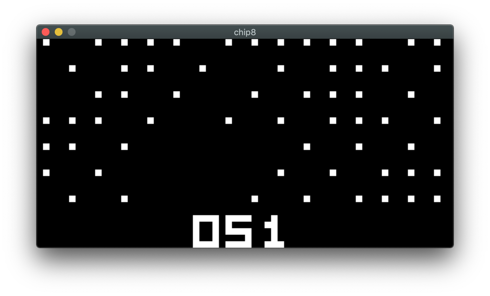
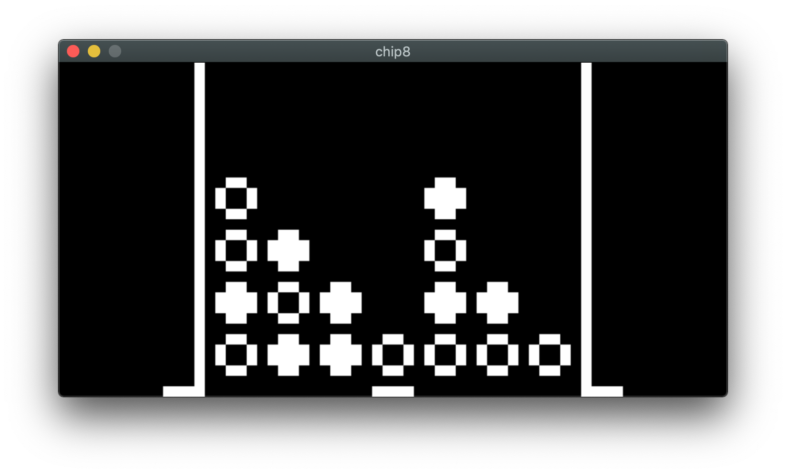
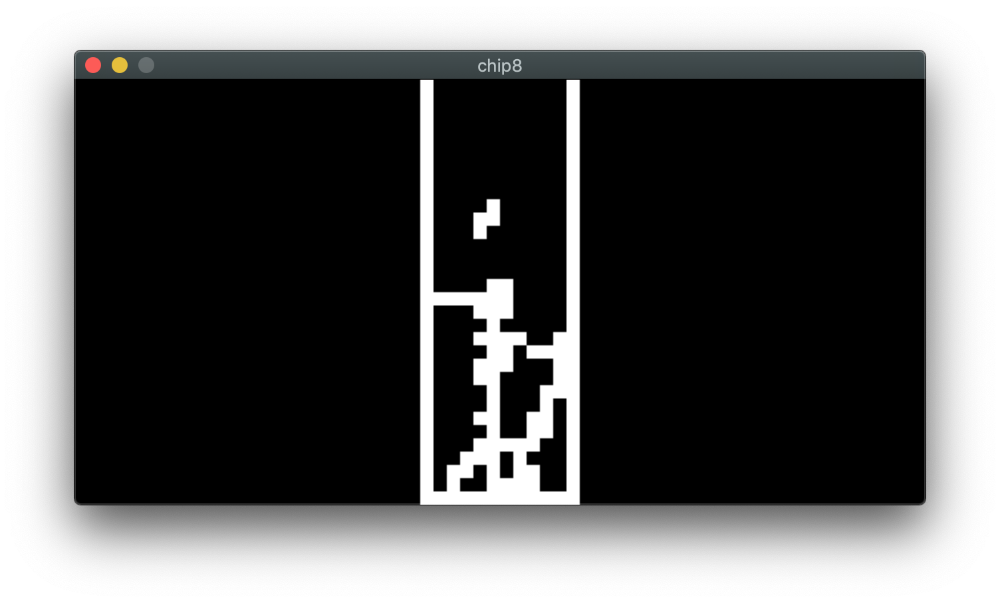
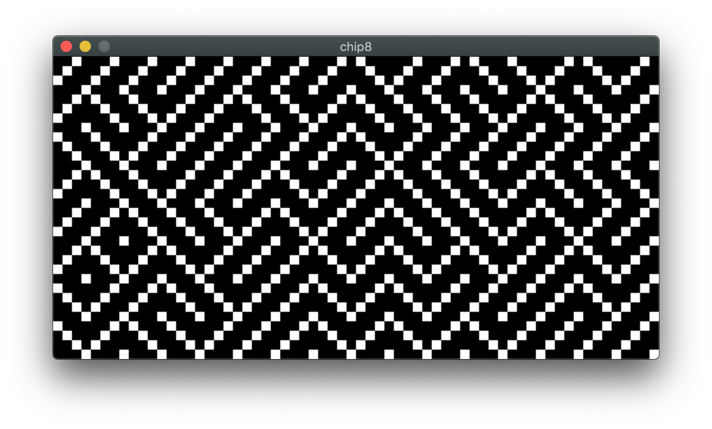

<div align='center'>
    <h1>Chip-8 Emulator</h1><br>
</div>

A Chip-8 Emulator written in C++ using SDL2 and SDL_Mixer. 

## Screenshots



|            CONNECT4             |            TETRIS             |            MAZE             |
| :-----------------------------: | :---------------------------: | :-------------------------: |
|  |  |  |


## Usage

SDL2 and SDL_Mixer must be installed. For Mac users, you can install them with Homebrew:
```
    brew install sdl2 sdl_mixer
```

Afterwards, compile and run. 

```
    cd src
    make
    ./main.out <ROM>
```

If \<ROM> is not given, PONG2 will be loaded instead by default. 

## Notes
 * TICTAC and CONNECT4 only work properly when INSTRUCTIONS_PER_STEP = 1 in main.cpp
 * Changing INSTRUCTIONS_PER_STEP will make some games run better
 * The original Chip8 numpad is not used. The keypad is defined as:
  ```
    Current    instead of    Original
    1 2 3 4                  1 2 3 C
    Q W E R                  4 5 6 D
    A S D F                  7 8 9 E
    Z X C V                  A 0 B F
  ```
 

## Resources Used
* [Cowgod Technical Reference](http://devernay.free.fr/hacks/chip8/C8TECH10.HTM)
*  [How to write an emulator (CHIP-8 interpreter) by Laurence Muller](http://www.multigesture.net/articles/how-to-write-an-emulator-chip-8-interpreter/)
* [Wikipedia: Chip-8](https://en.wikipedia.org/wiki/CHIP-8)
* [Zophar's Chip-8 Roms](https://www.zophar.net/pdroms/chip8.html)
* BC_test.ch8 by BestCoder
  * [rom](https://slack-files.com/T3CH37TNX-F3RF5KT43-0fb93dbd1f)
  * [rom doc](https://slack-files.com/T3CH37TNX-F3RKEUKL4-b05ab4930d)
* [test_opcode.ch8 by corax89](https://github.com/corax89/chip8-test-rom)